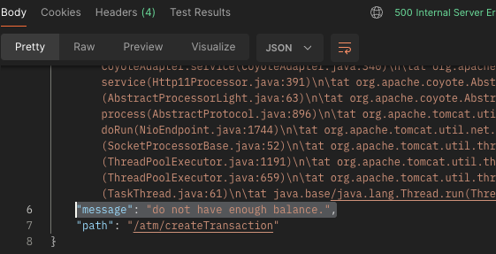
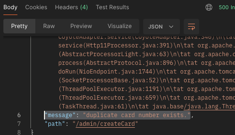
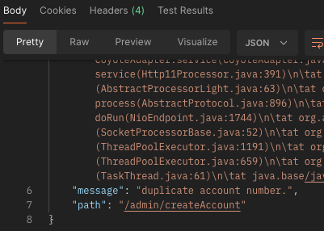
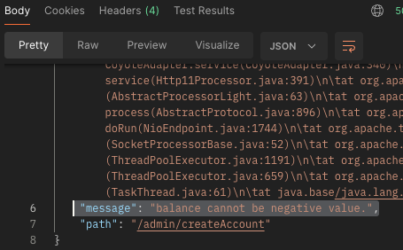

Requirement : docker


Please run the following commands

1. docker run --name be-db -e POSTGRES_PASSWORD=123 -p 5432:5432 -d postgres
2. docker exec -it be-db psql -U postgres      
3. CREATE DATABASE db;

TEST CASES :
- java/backend/atm/service/AtmServiceTest.java


## **ATM side APIs** 

### POST http://localhost:8080/atm/authCard
description : check whether inserted card & PIN is correct.

sample request body : 
```dbn-psql
{
    "cardNumber" : "4444333322221112",
    "pinNumber" : "123"
}
```
[APPROVE] sample response  :
```dbn-psql
{
    "message": null,
    "authCardStatus": "APPROVED",
    "cardPk": 1
}
```
[DECLINE] sample response  :
```dbn-psql
{
    "message": "incorrect pin number.",
    "authCardStatus": "DECLINED",
    "cardPk": null
}
```

### GET http://localhost:8080/atm/getAccounts/{cardPk}
description : retrieve all accounts with their balance.

sample response :
```dbn-psql
[
    {
        "pk": 1,
        "createdTime": "2024-02-22T17:33:52.438078",
        "updatedTime": "2024-02-22T17:33:52.438275",
        "cardPk": 1,
        "accountName": "default",
        "accountNumber": "12545541232323",
        "status": "CHECKING",
        "balance": 3000
    },
    {
        "pk": 2,
        "createdTime": "2024-02-22T17:33:55.576702",
        "updatedTime": "2024-02-22T17:33:55.576752",
        "cardPk": 1,
        "accountName": "default",
        "accountNumber": "125455412452323",
        "status": "CHECKING",
        "balance": 3000
    }
]
```
### POST http://localhost:8080/atm/createTransaction
description : with the selected account, user can WITHDRAW or DEPOSIT the money

request body sample 1 - WITHDRAW
```dbn-psql
{
    "accountPk" : 2,
    "amount" : 2800,
    "type" : "WITHDRAW"
}
```
[APPROVE] response
```
{
    "accountNumber": "12545541232323",
    "accountName": "default",
    "remainingBalance": 200,
    "transactionType": "WITHDRAW",
    "transactionAmount": 2800
}
```
[DECLINE] response

request body sample 2 - DEPOSIT
```dbn-psql
{
    "accountPk" : 2,
    "amount" : 2800,
    "type" : "DEPOSIT"
}
```
response
```dbn-psql
{
    "accountNumber": "125455412452323",
    "accountName": "default",
    "remainingBalance": 3000,
    "transactionType": "DEPOSIT",
    "transactionAmount": 2800
}
```


-----------


# ADMIN side APIs
### POST http://localhost:8080/admin/createCard

request  sample body
```dbn-psql
{
    "cardNumber" : "4444333334221112",
    "pinNumber" : "123",
    "firstName" : "gawun",
    "lastName" : "kim"
}
```
[APPROVE] response sample
```dbn-psql
{
    "pk": 5,
    "createdTime": "2024-02-22T17:39:33.102013",
    "updatedTime": "2024-02-22T17:39:33.102071",
    "cardNumber": "4444333334221112",
    "pinNumber": "123",
    "firstName": "gawun",
    "lastName": "kim"
}
```
[DECLINE] response sample - same card number is already in db.


### POST http://localhost:8080/admin/createAccount

Description : create accounts under a given card.

request body sample
```dbn-psql
{
    "cardPk" : 1,
    "accountName" : "default",
    "accountNumber" : "125455412452323",
    "balance" : 3000
}
```
response sample
```dbn-psql
{
    "pk": 2,
    "createdTime": "2024-02-22T17:33:55.576702",
    "updatedTime": "2024-02-22T17:33:55.576752",
    "cardPk": 1,
    "accountName": "default",
    "accountNumber": "125455412452323",
    "status": "CHECKING",
    "balance": 3000
}
```


[DECLINE] response sample1 - duplicate account number




[DECLINE] response sample2 - negative balance


